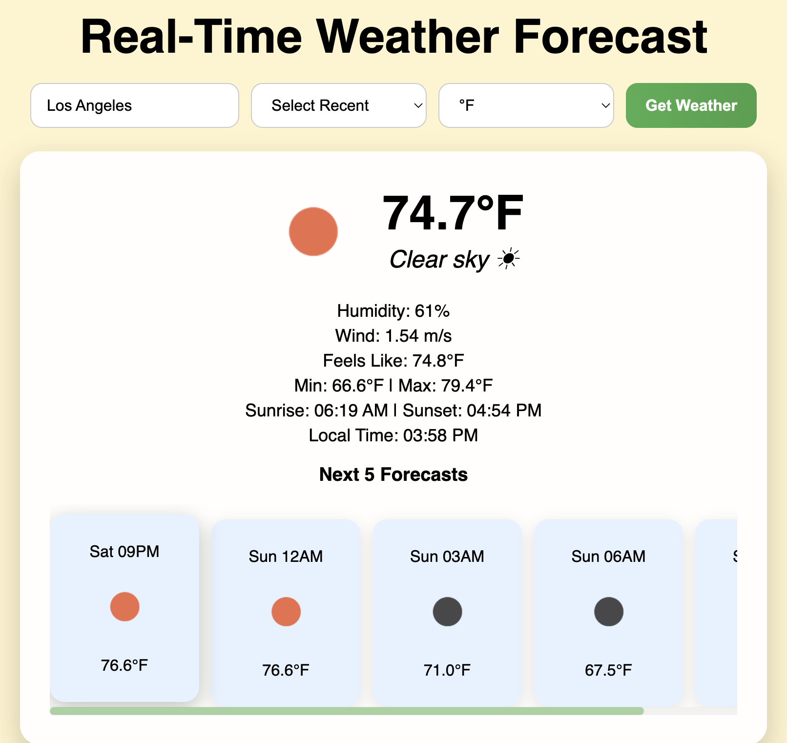

# Weather Forecast Web App 🌤️

A simple and interactive web application built with **Flask** that allows users to check the current weather and a short-term forecast for any city. The app fetches data from the **OpenWeatherMap API** and displays it with modern styling, icons, and emojis.

---

## Features

- Current weather for any city worldwide
  - Temperature (Celsius or Fahrenheit)
  - Weather description with emojis
  - Humidity, wind speed, feels like temperature
  - Sunrise, sunset, and local time
- 5-step forecast for upcoming hours
- Recent cities feature (last 5 searched)
- Responsive design for mobile and desktop
- Color-coded background based on weather conditions
- Clean and modern UI with hover effects

---

## Demo

 

---

## Tech Stack

- **Backend:** Python, Flask
- **Frontend:** HTML, CSS
- **API:** OpenWeatherMap
- **Other:** `requests` library for API calls

---

## Installation & Setup

1. Clone the repository:

```bash
git clone https://github.com/yourusername/weather-app.git
cd weather-app
```

2. Install dependencies (preferably in a virtual environment):

```bash
pip3 install flask requests
```

3. Get an API key from OpenWeatherApp and replace the API_KET in app.py:

```bash
API_KEY = "YOUR_API_KEY"
```

4. Run the app:

```bash
python3 app.py
```

5. Open your browser and go to https://127.0.0.1:5000/


